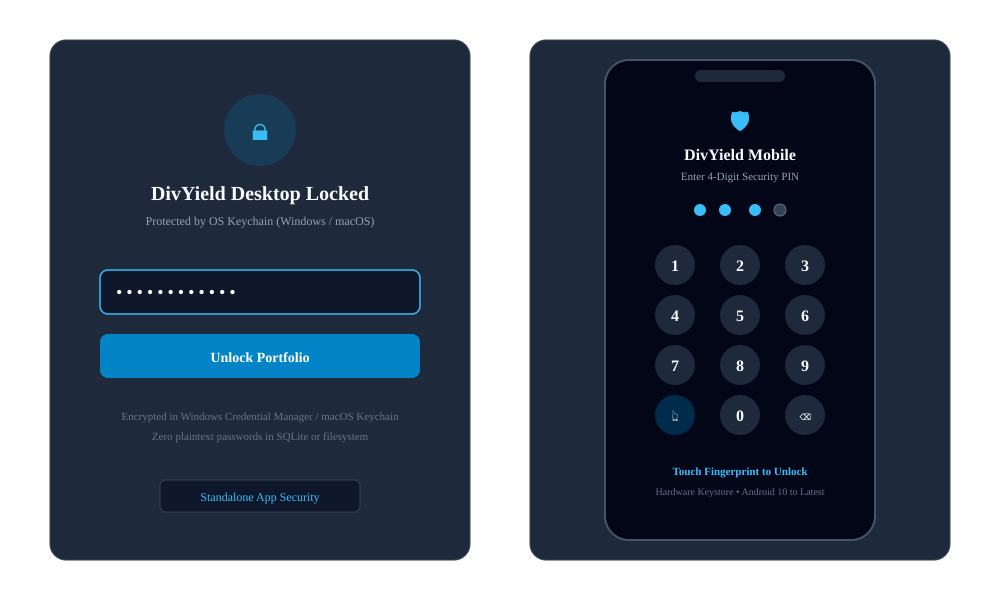

# DivYield 📈
If it is useful to you, you can click on the ```Star``` in the upper right corner of this repo to show your support. 

> **A fast, smooth, local-first portfolio & dividend tracker with strict read-only security.**

DivYield connects to your **Trading 212** account with **strict read-only permissions** and enriches your holdings with **Yahoo Finance** dividend data. It gives you a complete view of your actual received dividends, forward cashflow forecasts, diversification health, and Netherlands Box 3 wealth tax estimates.

Available as a **native desktop application** (Windows), a **native mobile app** (Android), and a **local web dashboard**.

---

## 📸 Screenshots & Visual Preview

<div align="center">

### Desktop Dashboard & Real-Time Tracking


<br/>

### Interactive Dividend Calendar & Payout Forecasts


<br/>

### Biometric, PIN & Desktop Password Lock


<br/>

### Android Mobile App & Upcoming Dividend Notifications


</div>

---

## 🚀 Pre-Built Downloads

Get the pre-compiled standalone app directly from [GitHub Releases](https://github.com/sunilsankar/DivYield/releases):

| Platform | Installer / Package | Features |
| :--- | :--- | :--- |
| 🪟 **Windows** | [`DivYield-Windows.msi`](https://github.com/sunilsankar/DivYield/releases) | MSI Installer with custom directory, Desktop shortcut, and uninstaller |
| 📱 **Android** | [`DivYield-Android.apk`](https://github.com/sunilsankar/DivYield/releases) | Standalone APK, on-device SQLite, hardware SecureStore |
| 🌐 **Web** | Self-hosted via FastAPI + Vite | Local browser dashboard at `localhost:8000` |

---

## 🌟 Key Features

### 🛡️ 1. Strict Read-Only Security & App Lock
- **No Mutation Capability**: Code-level allowlist explicitly blocks and rejects order placement, buying, selling, or money transfers.
- **Hardware-Backed Encryption**: Credentials are never stored in browser storage (`localStorage`) or plaintext database. Desktop uses the **OS Keychain** (`keyring` / Fernet AES-256), and mobile uses **Android Keystore** (`expo-secure-store`).
- **Desktop Password Protection**: Lock the standalone Windows app with an OS keychain-backed password and instant lock button.
- **Mobile Biometric & PIN Security**: Android app supports native biometric unlock (Fingerprint / Face Unlock via `expo-local-authentication`) with a secure 4-digit PIN fallback and automatic background relock.
- **Local-First Privacy**: Your portfolio and dividend history remain 100% on your device in SQLite (WAL mode).

### 🔔 2. Upcoming Dividend Notifications (Android 10+)
- **Automated Payout Alerts**: Schedules local 9:00 AM alarm notifications on the morning of forecasted dividend payment dates.
- **Privacy-Preserving**: Runs 100% on-device via native Android alarm scheduler without remote push servers, tracking, or battery drain.
- **Full Android 10+ Compatibility**: Handles Android 13+ `POST_NOTIFICATIONS` runtime permissions gracefully with fallback for Android 10–12.

### 📅 3. Visual Dividend Calendar
- **Interactive 31-Day Grid**: Visual calendar showing payment dates, individual ticker payouts, day totals, company names, and direct Trading 212 CDN stock logos.
- **Forecast & Received Tracking**: Distinguishes between verified cash received from Trading 212 and upcoming forward dividend events enriched by Yahoo Finance.
- **Smart Month Selection**: Auto-jumps to active dividend months and features day drawers to inspect high-volume payout dates.

### 🧾 4. Order & Activity History
- **Read-Only Activity Log**: Android displays synchronized Trading 212 orders, dividend receipts, deposits, withdrawals, and interest.
- **Simple Filters**: Switch between all activity, order executions, and cash/dividend history.

### ⚖️ 5. Portfolio Diversification & Risk Engine
- **Diversification Health Score (0–100)**: Composite rating assessing holding balance, sector spread, income spread, and asset count.
- **Concentration Analysis**: Calculates the Herfindahl-Hirschman Index (HHI) and highlights concentration warnings when single positions exceed 15% or sectors exceed 25%.
- **Geographic & Income Breakdown**: Evaluates currency exposure (USD, EUR, GBP) and ranks top income-generating assets.

### 📈 6. Forward Planning & Compounding Simulator
- **Multi-Year Compounding Engine**: Simulates dividend reinvestment (DRIP), annual dividend growth (CAGR), periodic cash contributions, and capital appreciation.
- **Annual Run-Rate & TTM**: Tracks Trailing 12 Months (TTM) income and projected 12-month forward annual dividend run-rate.

### 🇳🇱 7. Netherlands Box 3 Wealth Tax Estimator
- **Versioned Tax Rules**: Built-in statutory schedules for 2024, 2025, and 2026.
- **Deemed Return Calculations**: Accounts for bank savings vs. investment deemed yields, single vs. fiscal partner tax-free allowances, and 15% creditable dividend withholding tax.
- **Audit Export**: Generates compliant CSV tax estimate exports with legal disclaimers.

### 🎨 8. Modern Apple HIG UI & Theme Switcher
- **Apple Human Interface Guidelines (HIG)**: Crisp San Francisco typography, flush sidebar navigation, and fluid transitions.
- **Dual Aesthetic Modes**: Instantly toggle between the clean **Modern Apple UI** and a playful **Hand-Drawn Sketch UI**.
- **Color Grading**: 5 custom palettes (Indigo Slate, Forest Mint, Warm Amber, Ruby Rose, Ocean Teal).

---

## 🔑 Trading 212 API Setup

DivYield requires an **API Key** and **API Secret** generated from your Trading 212 account. It runs strictly on read permissions.

> ⚠️ **Mandatory Credentials**: Both the **API Key** and **API Secret** are required to establish an authenticated connection with Trading 212.

### Generating Your API Credentials:
1. Log in to your Trading 212 account on the web or mobile app.
2. Go to **Settings > API (Beta)** and click **Generate API Key**.
3. Toggle the following permissions:

| Permission | Setting | Purpose |
| :--- | :--- | :--- |
| **Account data** | **ON** | Fetches account currency, cash balances, and equity |
| **History** | **ON** | Core historical access permission |
| **History - Dividends** | **ON** | Ingests verified cash dividend payments |
| **History - Orders** | **ON** | Ingests filled order history |
| **History - Transactions**| **ON** | Ingests deposits, withdrawals, and interest |
| **Metadata** | **ON** | Resolves company names, ISINs, and exchange listings |
| **Pies - Read** | **ON** | Reads portfolio pie allocations |
| **Portfolio** | **ON** | Retrieves current open positions and cost bases |
| **Orders - Execute** | ⛔ **OFF** | **STRICTLY FORBIDDEN** — Must remain off |
| **Pies - Write** | ⛔ **OFF** | **STRICTLY FORBIDDEN** — Must remain off |

4. Copy the generated **API Key** and **API Secret** into DivYield's **Settings > API Connections** and click **Save Key**.
5. Click **Sync Now** to populate your portfolio!

---

## 🛠️ Architecture & Tech Stack

```text
┌────────────────────────────────────────────────────────┐
│               DivYield Client Interfaces               │
├──────────────────────────┬─────────────────────────────┤
│   Desktop (pywebview)    │    Mobile (React Native)    │
│   FastAPI + React 19     │    Expo SDK 57 + SQLite     │
└────────────┬─────────────┴──────────────┬──────────────┘
             │                            │
   HTTP Read-Only Requests        Native API Requests
             ▼                            ▼
┌────────────────────────────────────────────────────────┐
│                 External Providers                     │
├────────────────────────────┬───────────────────────────┤
│  Trading 212 API (v0)      │  Yahoo Finance (yfinance) │
│  Read-Only Allowlist       │  Rate-Limited (3 req/s)   │
└────────────────────────────┴───────────────────────────┘
```

- **Desktop & Web**:
  - **Frontend**: Vite, React 19, TypeScript, Tailwind CSS v4, Recharts, Lucide Icons.
  - **Backend**: FastAPI, Python 3.11+, SQLite (WAL mode), Pydantic v2, HTTPX, `keyring`, `yfinance`.
  - **Packaging**: PyInstaller + `pywebview` for desktop, WiX Toolset v3 for Windows MSI installer.
- **Mobile**:
  - **Framework**: React Native 0.86, Expo SDK 57, TypeScript, Material Design 3.
  - **Persistence**: `expo-sqlite` (local on-device database), `expo-secure-store` (hardware keychain).

---

## 💻 Local Development Setup

### 1. Clone the Repository
```bash
git clone https://github.com/sunilsankar/DivYield.git
cd DivYield
```

### 2. Backend Setup
```bash
cd backend
python3 -m venv .venv
source .venv/bin/activate  # On Windows: .venv\Scripts\activate
pip install -r requirements.txt

# Run migrations and launch server
uvicorn app.main:app --reload --port 8000
```
API documentation will be accessible at `http://localhost:8000/docs`.

### 3. Frontend Setup
In a new terminal:
```bash
cd frontend
npm install
npm run dev
```
The web dashboard will be available at `http://localhost:5173`.

### 4. Native Desktop Runner
To run the packaged borderless desktop app locally:
```bash
# Build frontend first
cd frontend && npm run build && cd ..

# Launch desktop app
python desktop.py
```

### 5. Mobile App Setup (Expo)
```bash
cd mobile
npm install
npx expo start
```

---

## 🧪 Automated Testing

DivYield includes test suites verifying read-only enforcement, calculation accuracy, and API contracts.

```bash
# Backend pytest suite (68 tests)
pytest backend/tests

# Frontend vitest suite (15 tests)
npm --prefix frontend test -- --run

# Security SAST Scan
bandit -r backend/app/ -ll
```

---

## 📁 Repository Structure

```text
DivYield/
├── .github/workflows/       # CI/CD: Automated Windows and Android release pipeline
├── assets/                  # Brand SVG, PNG, ICO, and ICNS assets
├── backend/
│   ├── app/
│   │   ├── main.py          # FastAPI application & static file router
│   │   ├── config.py        # Environment & platform-aware paths
│   │   ├── database.py      # SQLite WAL schemas & auto-indexing
│   │   ├── credentials.py   # OS Keychain & Fernet encryption
│   │   ├── providers/       # Trading 212 read-only provider & allowlist
│   │   ├── services/        # Sync orchestrator, yfinance enrichment, tax engine
│   │   └── routers/         # API v1 routes (portfolio, dividends, analytics, etc.)
│   └── tests/               # Backend pytest suites
├── frontend/
│   ├── src/
│   │   ├── components/      # UI components (dashboard, calendar, holdings, etc.)
│   │   ├── context/         # ThemeContext (Modern vs Sketch, color grading)
│   │   ├── hooks/           # useBodyScrollLock and responsive utilities
│   │   └── lib/api.ts       # Type-safe client for API v1
│   └── tests/               # Frontend Vitest suites
├── mobile/                  # Native Android React Native Expo application
│   ├── src/
│   │   ├── components/      # Material 3 screens (Dashboard, Calendar, History, Holdings)
│   │   └── services/        # Local SQLite database & secure credentials storage
│   └── app.json             # Expo configuration & app identity
├── wix/                     # WiX Toolset v3 XML installer configuration (.msi)
├── desktop.py               # pywebview desktop application entrypoint
└── DivYield.spec            # PyInstaller binary bundling specification
```

---

## 🔒 Security & Privacy Notice

DivYield is strictly local-first and read-only:
- Your credentials never leave your local device.
- All calculations, tax estimates, and projections are computed locally.
- DivYield estimates are for planning purposes and do not constitute official financial or tax advice.

---

## 📄 License

Licensed under the [Apache License, Version 2.0](LICENSE).
