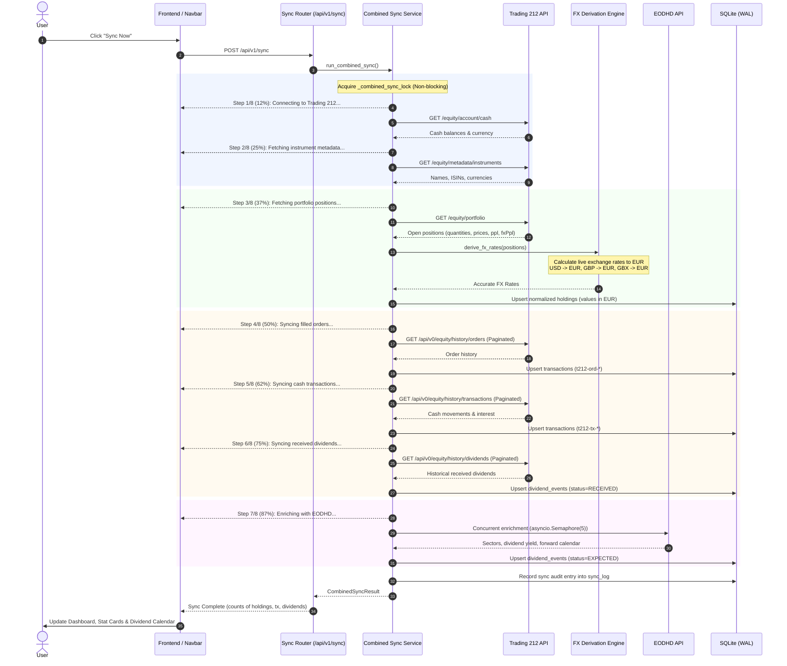

# DivYield Architecture & System Design

This document details the architectural design, security model, and data pipelines of DivYield.

---

## 1. High-Level Architectural Diagram

```mermaid
flowchart TB
    subgraph ClientLayer["Client Layer (User Interface)"]
        WebUI["Web Application (React 18 + TS + Tailwind CSS)"]
        DesktopApp["Desktop App (pywebview Native Window)"]
        ThemeEngine["Theme & Styling Engine (Apple HIG / Sketch UI / Color Grading)"]
    end

    subgraph DesktopShell["Desktop Shell (desktop.py)"]
        SocketAllocator["Ephemeral Port Allocator (port=0)"]
        StaticServer["Static File Server (React dist mounted at /)"]
    end

    subgraph APILayer["API Gateway (FastAPI @ /api/v1)"]
        MainApp["FastAPI Main (app/main.py)"]
        HealthRouter["/health"]
        CredsRouter["/credentials & /connections"]
        PortfolioRouter["/portfolio & /holdings"]
        TxRouter["/transactions"]
        DivRouter["/dividends & /calendar"]
        SyncRouter["/sync (trigger & progress status)"]
        AnalyticsRouter["/analytics (overview, allocation, projections, growth)"]
        TaxRouter["/tax (rules, Netherlands Box 3, export)"]
        DataToolsRouter["/data-tools (interest, manual entries, CSV)"]
        ExportRouter["/export (transactions, dividends, Yahoo format)"]
    end

    subgraph ServiceLayer["Core Domain Services"]
        CombinedSync["Combined Sync Orchestrator (combined_sync.py)"]
        T212Sync["Trading 212 Sync & FX Derivation (trading212_sync.py)"]
        EODHDEnrichment["EODHD Enrichment & Symbol Mapping (eodhd_enrichment.py)"]
        TaxEngine["Netherlands Box 3 Engine (tax_engine.py)"]
        CashInterestService["Uninvested Cash Interest Service (cash_interest.py)"]
        CSVService["CSV Import / Export Engine (csv_io.py)"]
    end

    subgraph SecurityLayer["Security & Credential Management"]
        SecurityAllowlist["Read-Only Allowlist Guard (trading212_allowlist.py)"]
        KeyringManager["OS Keychain Manager (macOS / Windows / SecretService)"]
        FernetFallback["Encrypted Secrets Fallback (data/.secrets.enc with 0600 key)"]
    end

    subgraph StorageLayer["Persistence Layer (SQLite in WAL Mode)"]
        DB[(divyield.db)]
        TableHoldings["holdings (with EUR normalized market values & fx_rate)"]
        TableTx["transactions (orders, deposits, interest, withdrawals)"]
        TableDividends["dividend_events (RECEIVED from T212, EXPECTED from EODHD)"]
        TableMappings["instrument_mappings (T212 identifier -> EODHD symbol)"]
        TableSyncLog["sync_log (provider, status, items_synced, timestamp)"]
        TableSettings["settings (connection statuses, metadata, cash balances)"]
        TableInterest["cash_interest (period records, rates, earned)"]
        Indices["Composite Indices (idx_transactions_type_date, idx_holdings_qty_market_val, idx_dividend_events_status_date)"]
    end

    subgraph ExternalProviders["External Financial APIs & CDNs"]
        T212API["Trading 212 Public API v0 (Strict Read-Only)"]
        EODHDAPI["EODHD Financial API (Dividends, Calendar, Fundamentals)"]
        T212CDN["Trading 212 Equities S3 CDN (Direct Company Logos)"]
    end

    %% Client Layer Connections
    DesktopApp --> SocketAllocator
    SocketAllocator --> MainApp
    DesktopApp --> WebUI
    WebUI --> ThemeEngine
    WebUI -- "HTTP REST (JSON)" --> MainApp

    %% Direct CDN logo fetching from browser
    WebUI -- "Direct Image Load (No Local Storage)" --> T212CDN

    %% Routing
    MainApp --> HealthRouter
    MainApp --> CredsRouter
    MainApp --> PortfolioRouter
    MainApp --> TxRouter
    MainApp --> DivRouter
    MainApp --> SyncRouter
    MainApp --> AnalyticsRouter
    MainApp --> TaxRouter
    MainApp --> DataToolsRouter
    MainApp --> ExportRouter

    %% Services & Logic
    SyncRouter --> CombinedSync
    CredsRouter --> KeyringManager
    KeyringManager -. Fallback .-> FernetFallback

    CombinedSync --> T212Sync
    CombinedSync --> EODHDEnrichment
    T212Sync --> SecurityAllowlist
    SecurityAllowlist --> T212API

    EODHDEnrichment --> EODHDAPI

    AnalyticsRouter --> TableHoldings
    AnalyticsRouter --> TableDividends
    TaxRouter --> TaxEngine
    TaxEngine --> TableHoldings
    TaxEngine --> TableSettings
    DataToolsRouter --> CashInterestService
    DataToolsRouter --> CSVService

    %% Database writes and reads
    T212Sync --> TableHoldings
    T212Sync --> TableTx
    T212Sync --> TableDividends
    T212Sync --> TableSettings
    T212Sync --> TableSyncLog

    EODHDEnrichment --> TableHoldings
    EODHDEnrichment --> TableDividends
    EODHDEnrichment --> TableMappings

    PortfolioRouter --> TableHoldings
    TxRouter --> TableTx
    DivRouter --> TableDividends
```



---

## 2. System Components & Layers

### 2.1 Frontend Client
- **Framework**: React 18, TypeScript, Tailwind CSS, Vite.
- **Visual Presentation**:
  - **Apple HIG Mode**: Native San Francisco typography (`-apple-system`), `#f5f5f7` window backgrounds, flush translucent sidebar, Apple Blue accents (`#007aff`).
  - **Hand-Drawn Sketch Mode**: Paper grid theme, organic borders, ink drop shadows, and playful typography (`Architects Daughter`, `Patrick Hand`).
  - **Color Grading**: Dynamic accent switching (Indigo, Forest Mint, Warm Amber, Ruby Rose, Ocean Teal).
- **Direct Logo CDN Integration**: Stock logos are loaded directly in the client via `https://trading212equities.s3.eu-central-1.amazonaws.com/{cleanTicker}.png` with an initial-avatar fallback. No image assets are stored locally.

### 2.2 Desktop Shell (`desktop.py` & `DivYield.spec`)
- Employs **`pywebview`** to generate a native window without browser address bars.
- Uses an OS socket allocator (`port=0`) to select a random free port on startup, eliminating port collision issues.
- Starts `uvicorn` in a background daemon thread serving both API endpoints and React build assets.
- Automatically resolves persistent storage paths to OS-native AppData directories (`~/Library/Application Support/DivYield` or `%APPDATA%\DivYield`).

### 2.3 API Gateway (`backend/app/main.py`)
- Standardized under versioned prefix **`/api/v1`**.
- Fully decoupled: supports the React frontend, desktop wrapper, and future React Native / Expo mobile applications.
- CORS configured for local clients (`http://localhost:5173`, `http://127.0.0.1:*`).

---

## 3. Security & Safety Model

### 3.1 Strict Read-Only Policy
DivYield is explicitly designed with **read-only access**. Under no circumstances can DivYield execute trades or manipulate user accounts.

```text
Trading 212 API Key Permissions:
Account data              ON
History                   ON
History - Dividends       ON
History - Orders          ON
History - Transactions    ON
Metadata                  ON
Orders - Execute         OFF (MANDATORY)
```

1. **Allowlist Enforcement**: `app/providers/trading212_allowlist.py` defines `TRADING212_READ_ALLOWLIST` with permitted GET routes only.
2. **Forbidden Action Blocking**: `FORBIDDEN_OPERATIONS` rejects methods and endpoints containing `buy`, `sell`, `place_order`, `execute_order`, `modify_order`, `cancel_order`, or `transfer`.
3. **Automated Verification**: Automated test suite (`test_trading212_readonly.py`) runs in CI to verify that no mutation methods exist anywhere in the codebase.

### 3.2 Key & Credential Protection
- API keys are **never** stored in plain SQLite, localStorage, or git.
- The `app/credentials.py` module uses **`keyring`** to access the operating system's native keychain:
  - macOS: Keychain Services
  - Windows: Windows Credential Manager
  - Linux: SecretService / FreeDesktop
- **Fernet Fallback**: On headless systems without a desktop keychain daemon, keys are encrypted using symmetric Fernet cryptography (`data/.secrets.enc`) with strict `0600` key permissions (`data/.secret.key`).
- API endpoints return credentials masked (e.g., `••••••••1234`).

---

## 4. Unified Sync Pipeline

The sync pipeline (`app/services/combined_sync.py`) coordinates data ingestion from Trading 212 and enrichment from EODHD:



---

## 5. Valuation & Currency Normalization

To ensure portfolio valuation matches the broker exactly, DivYield eliminates cross-currency distortion (such as counting British pence `GBX` 1:1 with EUR):

1. **FX Derivation**:
   $$\text{Local PnL} = (\text{Current Price} - \text{Average Price}) \times \text{Quantity}$$
   $$\text{EUR PnL} = \text{ppl} - (\text{fxPpl} \lor 0)$$
   $$\text{FX Rate} = \frac{\sum \text{EUR PnL}}{\sum \text{Local PnL}}$$
2. **Normalized Storage**:
   All holdings store:
   - `market_value` $= \text{Quantity} \times \text{Current Price} \times \text{FX Rate}$
   - `currency` $= \text{"EUR"}$
   - `fx_rate` $= \text{Derived Rate}$
3. **Dividend Consistency**:
   Received dividend records prefer Trading 212's `amountInEuro`. Forward scheduled dividends from EODHD are converted using `fx_rate` and stored in EUR.

---

## 6. Performance & Scalability

- **SQLite WAL Mode**: Configured with `PRAGMA journal_mode=WAL` and `PRAGMA synchronous=NORMAL` for concurrent reads without write blocking.
- **Database Indexing**:
  - `idx_transactions_type_date`: Accelerates activity filtering by type (BUY, SELL, DIVIDEND) and chronological sorting.
  - `idx_dividend_events_status_date`: Accelerates calendar queries filtering by `RECEIVED` vs `EXPECTED`.
  - `idx_holdings_qty_market_val`: Optimizes portfolio weighting and top holdings calculations.
- **Asynchronous Concurrency**: EODHD enrichment utilizes `asyncio.Semaphore(5)` to fetch company fundamentals in parallel while respecting provider rate limits.
- **Adaptive Backoff**: HTTP client pauses on HTTP 429 and exponential backoffs (up to 10s) prevent account lockouts.

---

## License

DivYield is licensed under the **Apache License, Version 2.0**. See [LICENSE](../LICENSE) for details.
