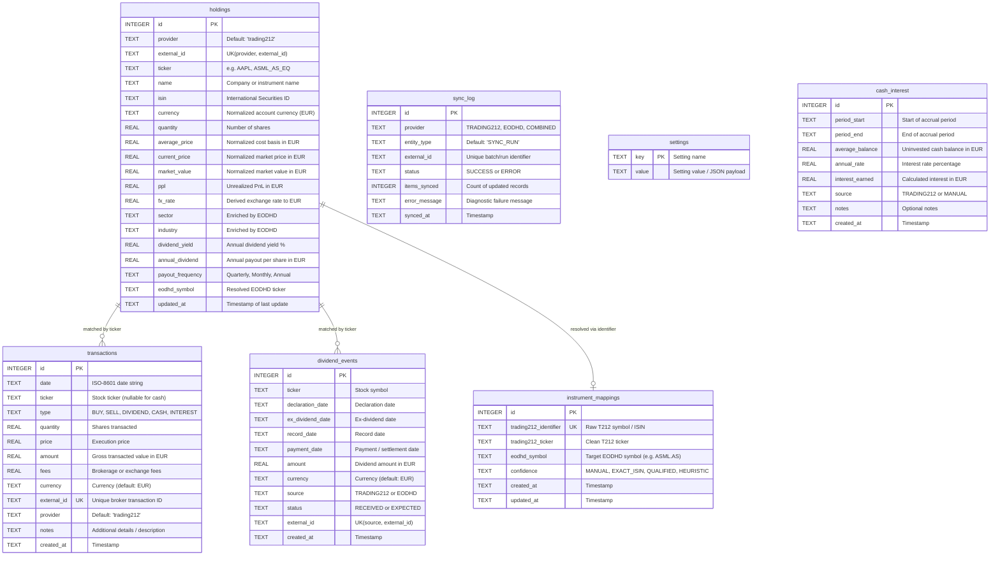

# DivYield SQLite Database Schema & Data Dictionary

DivYield uses an embedded **SQLite 3** database operating in **Write-Ahead Logging (WAL)** mode for persistent storage.

---

## 1. Entity-Relationship (ER) Diagram



---

## 2. Table Specifications

### 2.1 `holdings`
Represents the investor's current active open positions. Updated during every synchronization run. Values are strictly normalized to the account currency (EUR).

| Column Name | Type | Constraints | Description |
|---|---|---|---|
| `id` | `INTEGER` | `PRIMARY KEY AUTOINCREMENT` | Internal synthetic holding ID |
| `provider` | `TEXT` | `NOT NULL DEFAULT 'trading212'` | Originating broker source |
| `external_id` | `TEXT` | Composite `UNIQUE(provider, external_id)` | Broker's position identifier |
| `ticker` | `TEXT` | — | Primary stock ticker symbol |
| `name` | `TEXT` | — | Registered company name |
| `isin` | `TEXT` | — | International Securities Identification Number |
| `currency` | `TEXT` | — | Currency code normalized to `EUR` |
| `quantity` | `REAL` | `NOT NULL DEFAULT 0` | Current owned share quantity |
| `average_price` | `REAL` | `DEFAULT 0` | Average purchase price normalized to EUR |
| `current_price` | `REAL` | `DEFAULT 0` | Live market price normalized to EUR |
| `market_value` | `REAL` | `DEFAULT 0` | Quantity $\times$ Current Price $\times$ FX Rate in EUR |
| `ppl` | `REAL` | `DEFAULT 0` | Unrealized profit/loss in EUR |
| `fx_rate` | `REAL` | `DEFAULT 1.0` | Live derived exchange rate applied to position |
| `sector` | `TEXT` | — | Sector classification (enriched by EODHD) |
| `industry` | `TEXT` | — | Industry classification (enriched by EODHD) |
| `dividend_yield` | `REAL` | `DEFAULT 0` | Forward annual dividend yield % |
| `annual_dividend` | `REAL` | `DEFAULT 0` | Estimated annual dividend payout per share in EUR |
| `payout_frequency` | `TEXT` | — | Payout frequency (Monthly, Quarterly, Semi-Annual, Annual) |
| `eodhd_symbol` | `TEXT` | — | Resolved EODHD lookup symbol (e.g., `AAPL.US`, `ASML.AS`) |
| `updated_at` | `TEXT` | `DEFAULT CURRENT_TIMESTAMP` | Last updated timestamp (ISO-8601) |

---

### 2.2 `transactions`
Immutable ledger of all investment operations: stock buys, sells, dividends received, uninvested interest, and cash deposits/withdrawals.

| Column Name | Type | Constraints | Description |
|---|---|---|---|
| `id` | `INTEGER` | `PRIMARY KEY AUTOINCREMENT` | Internal unique transaction ID |
| `date` | `TEXT` | `NOT NULL` | Transaction execution date/time (ISO-8601) |
| `ticker` | `TEXT` | `NULL` | Associated ticker symbol (nullable for pure cash events) |
| `type` | `TEXT` | `NOT NULL` | Event type: `BUY`, `SELL`, `DIVIDEND`, `CASH`, `INTEREST` |
| `quantity` | `REAL` | `DEFAULT 0` | Number of shares bought or sold |
| `price` | `REAL` | `DEFAULT 0` | Execution price per share |
| `amount` | `REAL` | `DEFAULT 0` | Total monetary value in account currency |
| `fees` | `REAL` | `DEFAULT 0` | Associated taxes, conversion, or brokerage fees |
| `currency` | `TEXT` | `DEFAULT 'EUR'` | Currency of transaction |
| `external_id` | `TEXT` | `UNIQUE` | Unique external broker order or transaction ID |
| `provider` | `TEXT` | `DEFAULT 'trading212'` | Originating provider (`trading212`, `MANUAL`) |
| `notes` | `TEXT` | — | Transaction memo or description |
| `created_at` | `TEXT` | `DEFAULT CURRENT_TIMESTAMP` | Record ingestion timestamp |

---

### 2.3 `dividend_events`
Stores both historical **received** cash dividends (ingested from Trading 212) and forward **scheduled/expected** dividends (enriched from EODHD).

| Column Name | Type | Constraints | Description |
|---|---|---|---|
| `id` | `INTEGER` | `PRIMARY KEY AUTOINCREMENT` | Unique event ID |
| `ticker` | `TEXT` | `NOT NULL` | Stock symbol |
| `declaration_date` | `TEXT` | — | Date dividend was announced by company |
| `ex_dividend_date` | `TEXT` | — | Cut-off date to hold stock for dividend eligibility |
| `record_date` | `TEXT` | — | Company register date |
| `payment_date` | `TEXT` | — | Payout date (used for calendar display and sorting) |
| `amount` | `REAL` | — | Net dividend amount received or expected in EUR |
| `currency` | `TEXT` | `DEFAULT 'EUR'` | Payout currency code |
| `source` | `TEXT` | `NOT NULL` | Data source: `TRADING212` or `EODHD` |
| `status` | `TEXT` | `NOT NULL DEFAULT 'EXPECTED'` | Status: `RECEIVED` (actual cash) or `EXPECTED` (future) |
| `external_id` | `TEXT` | Composite `UNIQUE(source, external_id)` | Unique source event identifier |
| `created_at` | `TEXT` | `DEFAULT CURRENT_TIMESTAMP` | Record ingestion timestamp |

---

### 2.4 `instrument_mappings`
Maps Trading 212 internal identifiers and tickers to standardized EODHD exchange symbols.

| Column Name | Type | Constraints | Description |
|---|---|---|---|
| `id` | `INTEGER` | `PRIMARY KEY AUTOINCREMENT` | Unique mapping ID |
| `trading212_identifier` | `TEXT` | `NOT NULL UNIQUE` | Exact Trading 212 symbol identifier (e.g. `ASML_NL_EQ`) |
| `trading212_ticker` | `TEXT` | — | Clean ticker symbol (e.g. `ASML`) |
| `eodhd_symbol` | `TEXT` | `NOT NULL` | Target EODHD symbol (e.g. `ASML.AS`) |
| `confidence` | `TEXT` | `DEFAULT 'MANUAL'` | Confidence score: `MANUAL`, `EXACT_ISIN`, `EXCHANGE_QUALIFIED`, `HEURISTIC` |
| `created_at` | `TEXT` | `DEFAULT CURRENT_TIMESTAMP` | Created timestamp |
| `updated_at` | `TEXT` | `DEFAULT CURRENT_TIMESTAMP` | Last updated timestamp |

---

### 2.5 `sync_log`
Tracks the history and operational telemetry of synchronization runs.

| Column Name | Type | Constraints | Description |
|---|---|---|---|
| `id` | `INTEGER` | `PRIMARY KEY AUTOINCREMENT` | Unique log entry ID |
| `provider` | `TEXT` | `NOT NULL` | `TRADING212`, `EODHD`, or `COMBINED` |
| `entity_type` | `TEXT` | `NOT NULL DEFAULT 'SYNC_RUN'` | Entity type tracked |
| `external_id` | `TEXT` | Composite `UNIQUE(provider, entity_type, external_id)` | Batch execution ID |
| `status` | `TEXT` | `DEFAULT 'SUCCESS'` | Run outcome: `SUCCESS` or `ERROR` |
| `items_synced` | `INTEGER` | `DEFAULT 0` | Total records ingested or modified |
| `error_message` | `TEXT` | — | Error details if run failed |
| `synced_at` | `TEXT` | `DEFAULT CURRENT_TIMESTAMP` | Run completion timestamp |

---

### 2.6 `settings`
Key-value store for application configuration, synchronization timestamps, and cached balance metrics.

| Column Name | Type | Constraints | Description |
|---|---|---|---|
| `key` | `TEXT` | `PRIMARY KEY` | Setting name (e.g. `account_free_cash`, `trading212_sync_status`, `last_synced`) |
| `value` | `TEXT` | `NOT NULL` | Setting value or serialized JSON payload |

---

### 2.7 `cash_interest`
Stores records of interest earned on uninvested cash balances.

| Column Name | Type | Constraints | Description |
|---|---|---|---|
| `id` | `INTEGER` | `PRIMARY KEY AUTOINCREMENT` | Unique interest record ID |
| `period_start` | `TEXT` | `NOT NULL` | Start date of accrual period |
| `period_end` | `TEXT` | `NOT NULL` | End date of accrual period |
| `average_balance` | `REAL` | `NOT NULL` | Average cash balance held over the period |
| `annual_rate` | `REAL` | `NOT NULL` | Annual interest rate % |
| `interest_earned` | `REAL` | `NOT NULL` | Net interest earned |
| `source` | `TEXT` | `DEFAULT 'TRADING212'` | Origin (`TRADING212`, `MANUAL`) |
| `notes` | `TEXT` | — | Optional notes |
| `created_at` | `TEXT` | `DEFAULT CURRENT_TIMESTAMP` | Record timestamp |

---

## 3. Database Indices & Performance Optimization

To guarantee sub-millisecond response times even with thousands of dividend events and order history entries, DivYield enforces composite indices:

```sql
-- 1. Accelerates chronological filtering on transactions (by BUY, SELL, DIVIDEND, etc.)
CREATE INDEX IF NOT EXISTS idx_transactions_type_date 
ON transactions(type, date DESC);

-- 2. Accelerates visual calendar queries separating RECEIVED cash vs EXPECTED events
CREATE INDEX IF NOT EXISTS idx_dividend_events_status_date 
ON dividend_events(status, payment_date DESC);

-- 3. Accelerates portfolio ranking and sector weight allocations
CREATE INDEX IF NOT EXISTS idx_holdings_qty_market_val 
ON holdings(quantity, market_value DESC);
```

---

## 4. Database PRAGMAs & SQLite Configuration

DivYield initializes SQLite connections with high-performance operational PRAGMAs:

```sql
PRAGMA journal_mode = WAL;
PRAGMA synchronous = NORMAL;
PRAGMA foreign_keys = ON;
PRAGMA busy_timeout = 5000;
```

- **`journal_mode = WAL`**: Readers do not block writers, and writers do not block readers. Enables non-blocking background sync while keeping the UI responsive.
- **`synchronous = NORMAL`**: Eliminates unnecessary disk flushes while maintaining data integrity against software crashes.
- **`busy_timeout = 5000`**: Automatically waits up to 5 seconds if a lock contention occurs before throwing a database busy error.

---

## License

DivYield is licensed under the **Apache License, Version 2.0**. See [LICENSE](../LICENSE) for details.
